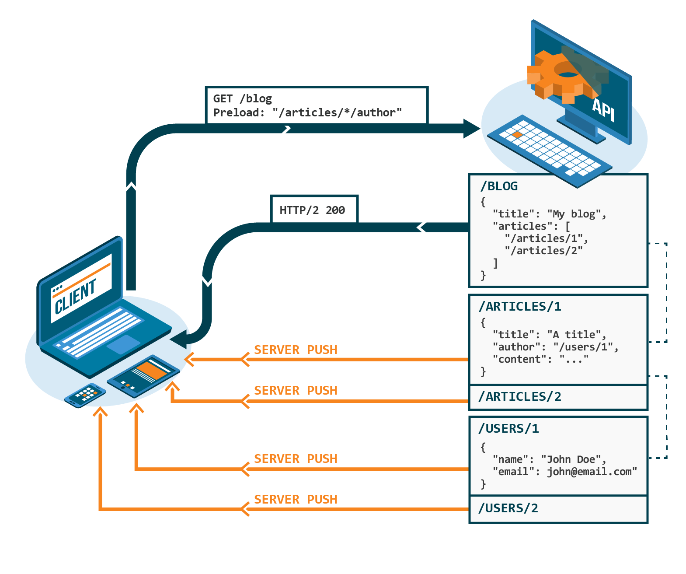

# Vulcain: Grab What You Need... Burn The REST!
*Protocol and Open Source Gateway*

Vulcain is a brand new protocol using HTTP/2 Server Push to create fast and idiomatic **client-driven REST** APIs.

An open source gateway server which you can put on top of **any existing web API** to instantly turn it into a Vulcain-compatible one is also provided! It supports [hypermedia APIs](https://restfulapi.net/hateoas/) but also any "legacy" API by documenting its relations using [OpenAPI](https://www.openapis.org/) [Link objects](http://spec.openapis.org/oas/v3.0.2#link-object).

* [Introduction](#introduction)
  * [Preloading](#preloading)
  * [Filtering](#filtering)
* [Gateway Server](docs/gateway.md)
* [Comparison with GraphQL](docs/graphql.md)
* [Prior Art](docs/prior-art.md)
* [Getting Help](docs/help.md)

The protocol has been published as [an Internet Draft](https://datatracker.ietf.org/doc/draft-dunglas-vulcain/) that [is maintained in this repository](spec/vulcain.md).

A reference, production-grade, implementation [**gateway server**](docs/gateway/install.md) is also available in this repository.
It's a free software (AGPL) written in Go. A Docker image is provided.

## Introduction

Over the years, several formats have been created to fix performance bottlenecks of web APIs: [over fetching, under fetching](https://stackoverflow.com/a/44568365/1352334), [the n+1 problem](https://restfulapi.net/rest-api-n-1-problem/)...
Current solutions for these problems ([GraphQL](https://graphql.org/), [embedded resources](https://api-platform.com/docs/core/serialization/#embedding-relations), [JSON:API's sparse fieldsets](https://jsonapi.org/format/#fetching-sparse-fieldsets)...) are smart [network hacks](https://apisyouwonthate.com/blog/lets-stop-building-apis-around-a-network-hack) for HTTP/1. But hacks that come with (too) many drawbacks when it comes to HTTP cache, logs and even security.
Fortunately, thanks to the new features introduced in HTTP/2, it's now possible to create true REST APIs fixing these problems with ease and class! Here comes Vulcain!

## Pushing Relations

Considering the following resources:

`/books`

~~~ json
{
    "member": [
        "/books/1",
        "/books/2"
    ]
}
~~~

`/books/1`

~~~ json
{
    "title": "1984",
    "author": "/authors/1"
}
~~~

`/books/2`

~~~ json
{
    "title": "Homage to Catalonia",
    "author": "/authors/1"
}
~~~

`/authors/1`

~~~ json
{
    "givenName": "George",
    "familyName": "Orwell"
}
~~~

`Preload` HTTP headers can be used to ask the server to immediately push resources related to the requested one using HTTP/2 Server Push:

~~~ http
GET /books/ HTTP/2
Preload: /member/*/author
~~~

In addition to `/books`, a Vulcain server uses HTTP/2 Server Push to push the `/books/1`, `/books/2` and `/authors/1` resources! When the client will follow the links and issue a new HTTP request (for instance using `fetch()`), the corresponding response will already by in cache, and will be used instantly!

## Filtering Resources

The `Fields` HTTP header allows the client to ask the server to return only the specified fields of the requested resource, and of the preloaded related resources.

Multiple `Fields` HTTP headers can be passed. All fields matching at least one of these headers will be returned. Other fields of the resource  will be omitted.

Considering the following resources:

`/books/1`

~~~ json
{
    "title": "1984",
    "genre": "novel",
    "author": "/authors/1"
}
~~~

`/authors/1`

~~~ json
{
    "givenName": "George",
    "familyName": "Orwell"
}
~~~

And the following HTTP request:

~~~ http
GET /books/1 HTTP/2
Preload: /author
Fields: /author/familyName
Fields: /genre
~~~

A Vulcain server will return a response containing the following JSON document:

~~~ json
{
    "type": "novel",
    "author": "/authors/1"
}
~~~

It will also push the following filtered `/authors/1` resource:

~~~ json
{
    "familyName": "Orwell"
}
~~~

## Credits

Created by [Kévin Dunglas](https://dunglas.fr). Sponsored by [Les-Tilleuls.coop](https://les-tilleuls.coop).

Ideas and code used in Vulcain's reference implementation have been taken from [Hades](https://github.com/gabesullice/hades), an HTTP/2 reverse proxy for JSON:API backend.
